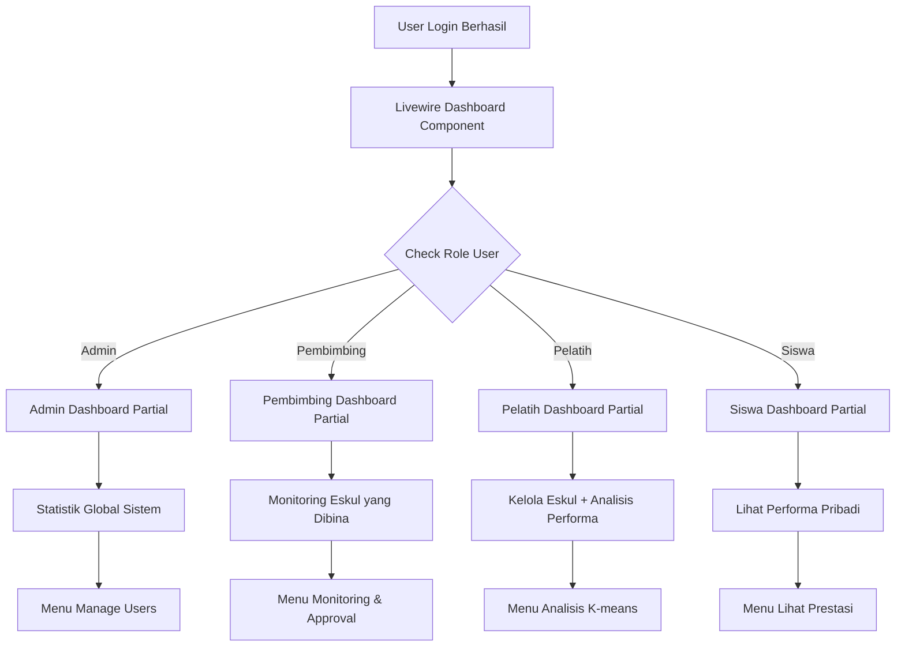
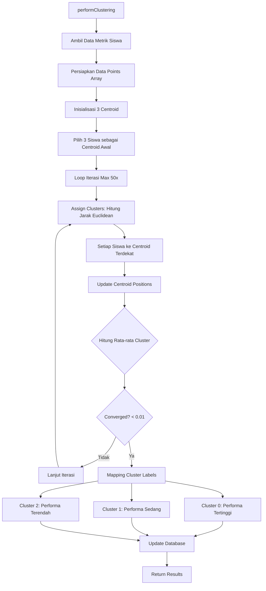
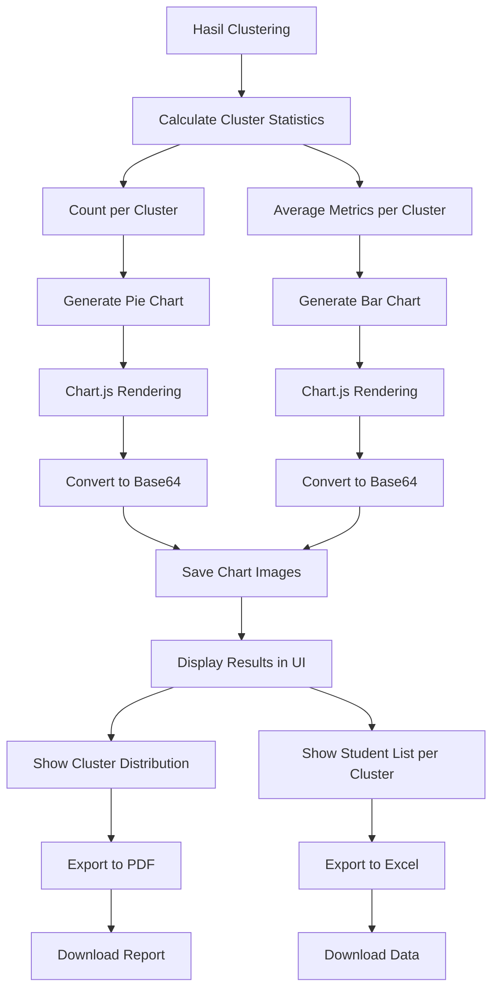
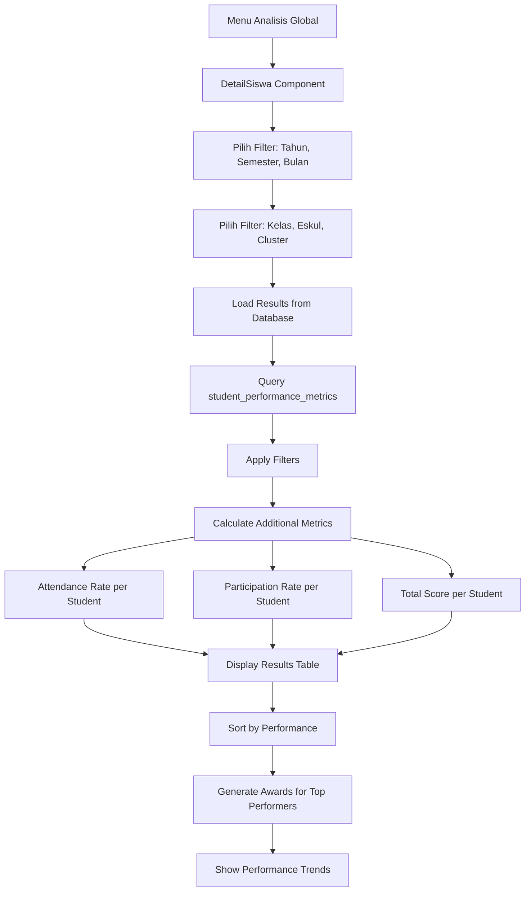
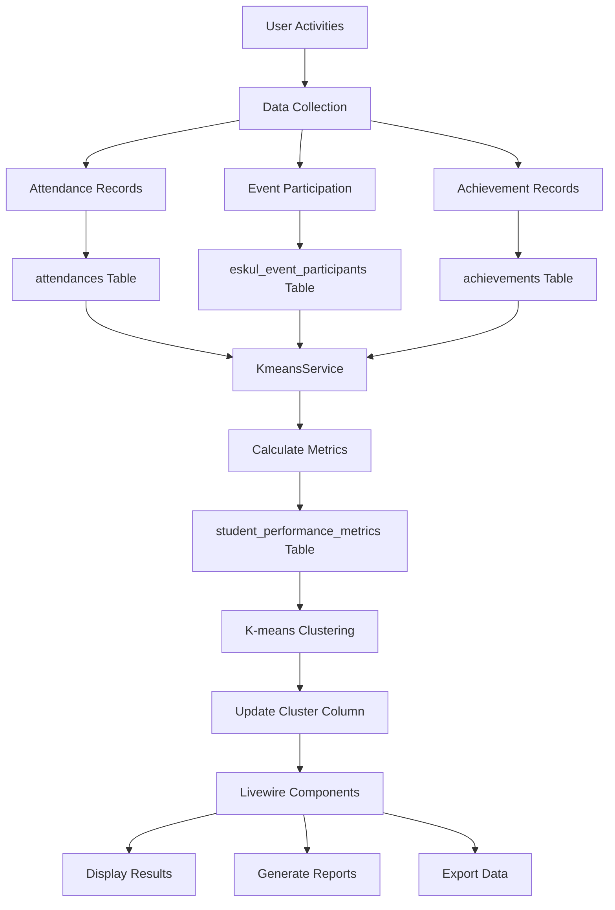
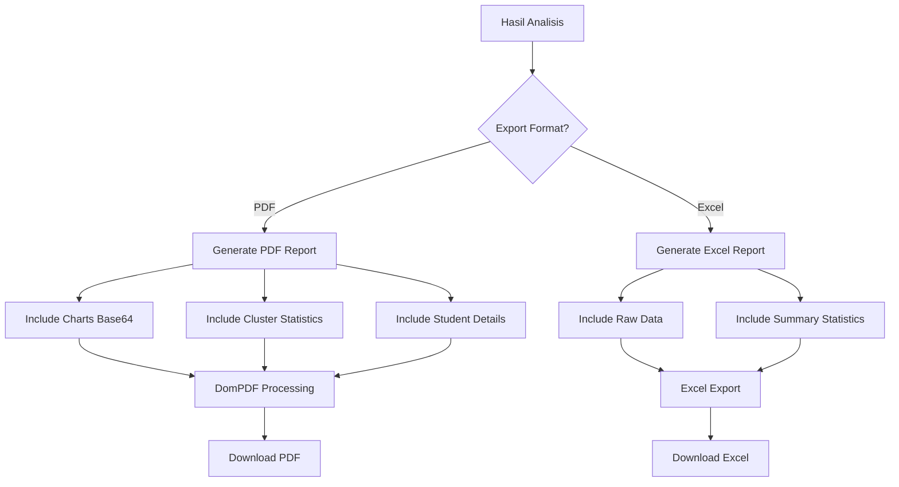
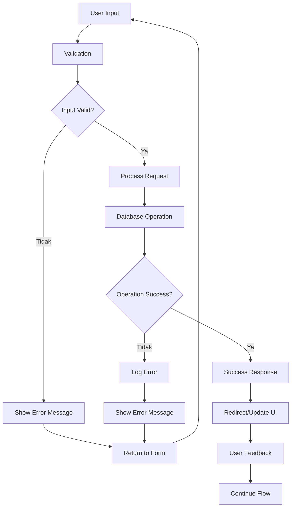

# FLOWCHART SISTEM MANAJEMEN ESKUL DENGAN IMPLEMENTASI K-MEANS

## OVERVIEW SISTEM
Sistem manajemen ekstrakurikuler yang menggunakan algoritma K-means untuk mengelompokkan siswa berdasarkan performa (kehadiran, partisipasi, dan prestasi).

---

## 1. FLOW AUTHENTICATION & LOGIN

```mermaid
flowchart TD
    A[User Mengakses Website] --> B{User Sudah Login?}
    B -->|Ya| C[Redirect ke Dashboard]
    B -->|Tidak| D[Tampilkan Halaman Login]
    
    D --> E[User Input Email & Password]
    E --> F[LoginController@authenticate]
    F --> G{Validasi Credentials}
    
    G -->|Gagal| H[Kembali ke Login + Error Message]
    G -->|Berhasil| I[Generate Session]
    
    I --> J{Check Role User}
    J -->|Admin| K[Admin Dashboard]
    J -->|Pembimbing| L[Pembimbing Dashboard]
    J -->|Pelatih| M[Pelatih Dashboard]
    J -->|Siswa| N[Siswa Dashboard]
    
    H --> E
    K --> O[Menu Management User]
    L --> P[Menu Monitoring Eskul]
    M --> Q[Menu Kelola Eskul + Analisis]
    N --> R[Menu Lihat Performa Pribadi]
```

**File yang Digunakan:**
- **Route:** `routes/web.php` (line 25-30)
- **Controller:** `app/Http/Controllers/Auth/LoginController.php`
- **View:** `resources/views/auth/login.blade.php`
- **Middleware:** `app/Http/Middleware/Authenticate.php`

---

## 2. FLOW DASHBOARD BERDASARKAN ROLE



**File yang Digunakan:**
- **Controller:** `app/Livewire/Dashboard/Dashboard.php`
- **Views:** 
  - `resources/views/livewire/dashboard/dashboard.blade.php`
  - `resources/views/livewire/dashboard/partials/admin-dashboard.blade.php`
  - `resources/views/livewire/dashboard/partials/pembina-dashboard.blade.php`
  - `resources/views/livewire/dashboard/partials/pelatih-dashboard.blade.php`
  - `resources/views/livewire/dashboard/partials/siswa-dashboard.blade.php`

---

## 3. FLOW ANALISIS K-MEANS (UNTUK PELATIH)

```mermaid
flowchart TD
    A[Pelatih Dashboard] --> B[Klik Menu Analisis Eskul]
    B --> C[EskulAnalisis Component]
    C --> D[Pilih Tahun & Semester]
    D --> E[Klik Tombol Analyze]
    
    E --> F[KmeansService@analyze]
    F --> G[Ambil Semua Siswa Aktif di Eskul]
    G --> H[Loop: Hitung Metrik Setiap Siswa]
    
    H --> I[calculateMetrics untuk Setiap Siswa]
    I --> J[Simpan ke student_performance_metrics]
    J --> K[performClustering]
    
    K --> L[Inisialisasi 3 Centroid]
    L --> M[Iterasi K-means Algorithm]
    M --> N{Converged?}
    
    N -->|Tidak| O[Update Centroid Positions]
    O --> P[Reassign Clusters]
    P --> M
    
    N -->|Ya| Q[Simpan Hasil Clustering]
    Q --> R[Tampilkan Hasil di UI]
    R --> S[Generate Charts & Reports]
```

**File yang Digunakan:**
- **Component:** `app/Livewire/EksulApps/EskulAnalisis.php`
- **Service:** `app/Services/KmeansService.php`
- **View:** `resources/views/livewire/eksul-apps/eskul-analisis.blade.php`
- **Database:** `student_performance_metrics` table

---

## 4. FLOW PERHITUNGAN METRIK SISWA

```mermaid
flowchart TD
    A[KmeansService@calculateMetrics] --> B{Month Parameter?}
    
    B -->|Ada Bulan| C[Set Periode 1 Bulan]
    B -->|Tidak Ada| D[Set Periode Semester Penuh]
    
    C --> E[calculateAttendanceScore]
    D --> F[calculateSemesterAggregateMetrics]
    
    E --> G[Count Kehadiran dalam Periode]
    F --> H[Loop Semua Bulan dalam Semester]
    
    H --> I[Set Periode per Bulan]
    I --> J[Hitung Metrik Bulan Ini]
    J --> K[Akumulasi Total]
    K --> L{Ada Bulan Lain?}
    
    L -->|Ya| I
    L -->|Tidak| M[Return Total Aggregat]
    
    G --> N[Return Attendance Score]
    M --> O[Return Aggregat Scores]
    
    N --> P[Return Metrics Object]
    O --> P
```

**Metrik yang Dihitung:**
1. **Attendance Score:** Jumlah kehadiran dalam periode
2. **Participation Score:** Jumlah partisipasi event dalam periode  
3. **Achievement Score:** Jumlah prestasi dalam periode

---

## 5. FLOW ALGORITMA K-MEANS CLUSTERING



**Algoritma K-Means:**
- **K = 3** (Tinggi, Sedang, Rendah)
- **Max Iterations:** 50
- **Convergence Tolerance:** 0.01
- **Distance Metric:** Euclidean Distance
- **Centroid Initialization:** Deterministic (Tertinggi, Tengah, Terendah)

---

## 6. FLOW VISUALISASI & REPORTING



**File yang Digunakan:**
- **Export:** `app/Exports/AnalysisReport.php`
- **PDF:** `Barryvdh\DomPDF\Facade\Pdf`
- **Excel:** `Maatwebsite\Excel\Facades\Excel`
- **Charts:** Chart.js via Livewire

---

## 7. FLOW DETAIL ANALISIS SISWA (GLOBAL)



**File yang Digunakan:**
- **Component:** `app/Livewire/AnalisisApps/DetailSiswa.php`
- **View:** `resources/views/livewire/analisis-apps/detail-siswa.blade.php`
- **Database:** `student_performance_metrics`, `users`, `user_details`, `eskuls`

---

## 8. FLOW DATABASE & DATA FLOW



**Database Tables:**
- `users` - Data user (admin, pembimbing, pelatih, siswa)
- `eskuls` - Data ekstrakurikuler
- `eskul_members` - Keanggotaan siswa di eskul
- `attendances` - Data kehadiran
- `eskul_events` - Event eskul
- `eskul_event_participants` - Partisipasi event
- `achievements` - Prestasi siswa
- `student_performance_metrics` - Metrik performa + hasil clustering

---

## 9. FLOW EXPORT & REPORTING



**File yang Digunakan:**
- **PDF Controller:** `app/Http/Controllers/EskulSchedulePdfController.php`
- **Excel Export:** `app/Exports/AnalysisReport.php`
- **PDF Library:** `barryvdh/laravel-dompdf`
- **Excel Library:** `maatwebsite/excel`

---

## 10. FLOW ERROR HANDLING & VALIDATION



---

## SUMMARY FILE UTAMA YANG DIGUNAKAN

### 1. **Authentication & Routes**
- `routes/web.php` - Definisi semua route
- `app/Http/Controllers/Auth/LoginController.php` - Login logic
- `resources/views/auth/login.blade.php` - Login form

### 2. **Dashboard & Role Management**
- `app/Livewire/Dashboard/Dashboard.php` - Main dashboard controller
- `resources/views/livewire/dashboard/` - Dashboard views per role

### 3. **K-means Implementation**
- `app/Services/KmeansService.php` - Core K-means algorithm
- `app/Livewire/EksulApps/EskulAnalisis.php` - Eskul analysis component
- `app/Livewire/AnalisisApps/DetailSiswa.php` - Global analysis component

### 4. **Data Models**
- `app/Models/User.php` - User model
- `app/Models/Attendance.php` - Attendance model
- `app/Models/Achievement.php` - Achievement model
- `app/Models/EskulMember.php` - Eskul membership model

### 5. **Database & Migrations**
- `database/migrations/` - Database structure
- `database/seeders/` - Sample data

### 6. **Views & UI**
- `resources/views/livewire/` - Livewire components
- `resources/views/components/` - Reusable components
- `resources/css/app.css` - Styling
- `resources/js/app.js` - JavaScript functionality

### 7. **Export & Reporting**
- `app/Exports/AnalysisReport.php` - Excel export
- `app/Http/Controllers/EskulSchedulePdfController.php` - PDF generation

---

## ALUR UTAMA SISTEM

1. **Login** → Authentication → Role-based Dashboard
2. **Dashboard** → Menu sesuai Role → Fitur yang Tersedia
3. **Analisis K-means** → Input Parameter → Calculate Metrics → Clustering → Results
4. **Visualization** → Charts → Reports → Export (PDF/Excel)
5. **Data Management** → CRUD Operations → Database Updates → Real-time UI Updates

Sistem ini menggunakan **Livewire** untuk real-time interactions dan **K-means clustering** untuk mengelompokkan siswa berdasarkan performa ekstrakurikuler mereka.
